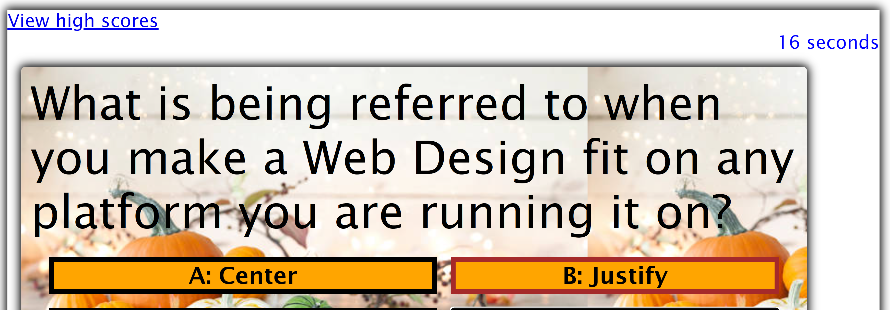

# api-code-quiz-challenge-4
Challenge 4 for Web APIs: Code Quiz

## Description

Creating a game that follows the below listed Acceptance Criteria.  The game will be timed and wrong answers will be penalized by deducting time from the timer.
Link to the game: https://labeutler.github.io/api-code-quiz-challenge-4/
Link to my github page: https://github.com/labeutler/api-code-quiz-challenge-4/edit/main/README.md

## Acceptance Criteria

GIVEN I am taking a code quiz 
WHEN I click the start button 
THEN a timer starts and I am presented with a question 
WHEN I answer a question 
THEN I am presented with another question 
WHEN I answer a question incorrectly 
THEN time is subtracted from the clock 
WHEN all questions are answered or the timer reaches 0 
THEN the game is over 
WHEN the game is over 
THEN I can save my initials and my score 

## Installation

N/A

## Usage (NEED TO UPDATE)

When clicking the link to start the game, you are presented with the following screen.

When clicking the start button, the game begins, a question presents and the timer begins to countdown.

When you click on an answer, the next question presents imediately after.

When game is over, you can enter your initials.

## Credits

shutterstock for image

## License

https://choosealicense.com/licenses/mit/
